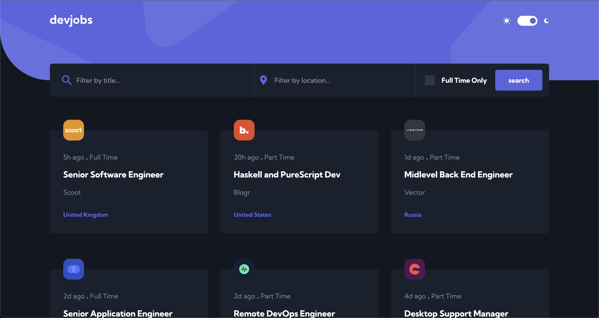

## Table of contents

- [Overview](#overview)
  - [The challenge](#the-challenge)
  - [Screenshot](#screenshot)
  - [Links](#links)

**Note: Delete this note and update the table of contents based on what sections you keep.**

## Overview

### The challenge

A front end app that displays a jobs board and offers the following features:

- Responsive
- Hover interactions
- Filter in client jobs on title, location, and is-full-time position
- Paging for jobs, fetching 6 each time
- Redirection from Job gallery to specific Job page
- Uses user preferred color scheme for dark mode and allows to change
- This exercise assumes the DB is always bringing all the fields from the DB, fail safes are not ink place

### Screenshot

### Links

- Solution URL: [https://github.com/rafazold/job-board](https://github.com/rafazold/job-board)
- Live Site URL: [https://rafa-jobs-board.netlify.app/](https://rafa-jobs-board.netlify.app/)

## My process

### Built with

- Semantic HTML5 markup
- Sass for easier management of css and variables
- Flexbox, CSS Grid, Mobile-first workflow
- used svelte global classes for reusable designs
- Svelte JS - JS library with static adapter